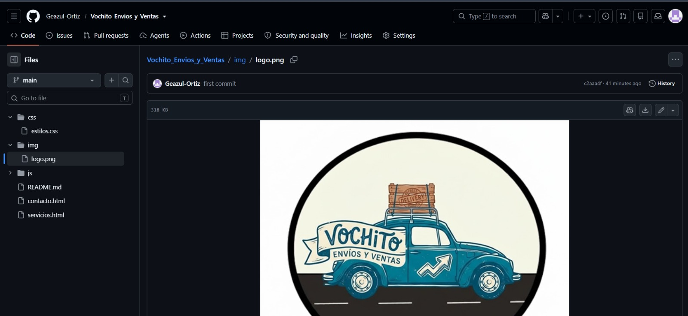
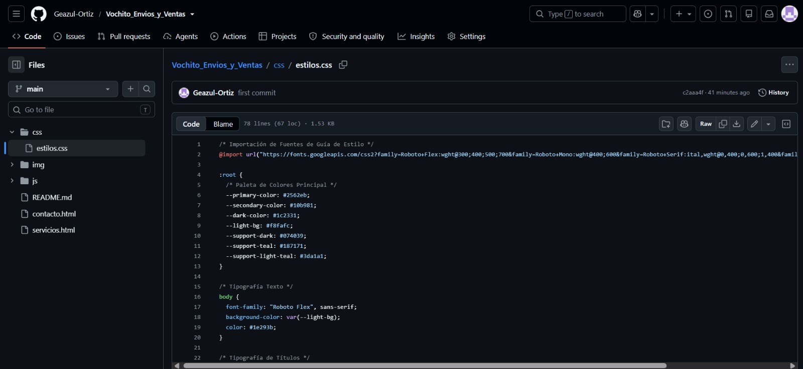
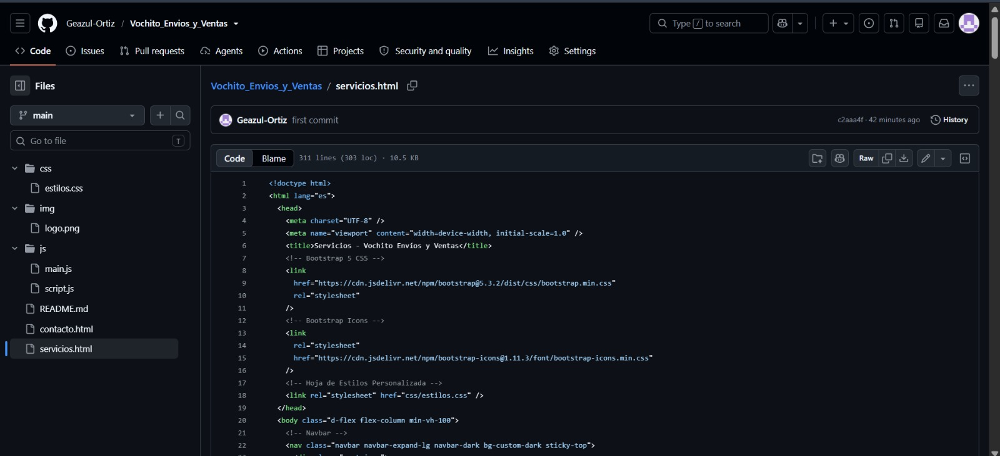
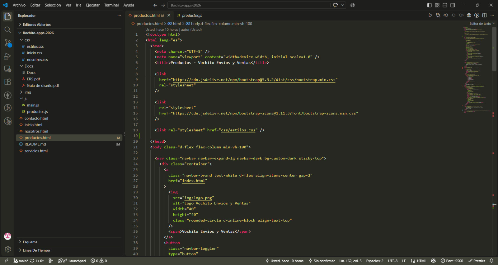
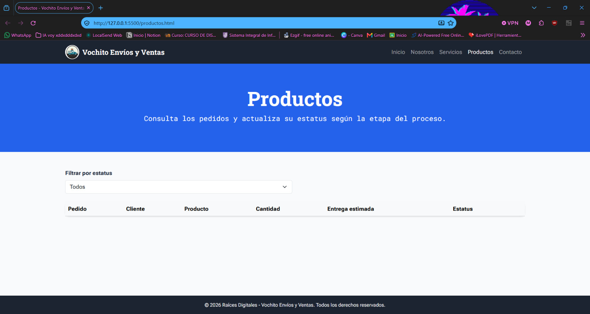
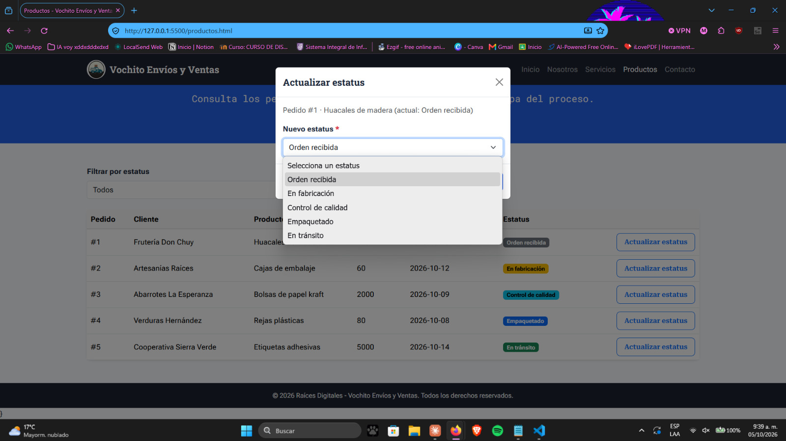

# Bochito

**Proyecto de Aplicaciones Web**

## Descripción del proyecto

Bochito es una aplicación web desarrollada como parte de la asignatura de Aplicaciones Web. Su propósito y sus funcionalidades se describen en los apartados de este documento, de acuerdo con los requisitos establecidos para el proyecto.

## Objetivo

Desarrollar una aplicación web que cumpla con los requerimientos funcionales y no funcionales definidos para el proyecto, aplicando tecnologías de desarrollo web y buenas prácticas de organización, diseño, programación y trabajo colaborativo.

## Integrantes del equipo

- **Líder del proyecto:** Vital Millan Dayra Naomi
- **Backend:** Guerrero López Miguel Angel
- **Frontend 1:** Carpio Campos Rodrigo
- **Frontend 2:** Ortiz Salguero Geazul Guadalupe
- **Analista:** Lorenzana Hernández Aarón Dahir

## Herramientas de desarrollo

- Visual Studio Code.
- GitHub.
- HTML, CSS, JavaScript y Bootstrap, según las tecnologías implementadas.

## Estado del proyecto

En desarrollo.

## Componentes de Bootstrap utilizados

En el proyecto se utilizaron diferentes componentes de Bootstrap para facilitar el diseño y la organización de la página web. Entre ellos se encuentran:

- **Navbar:** utilizado para crear el menú de navegación.
- **Container:** utilizado para organizar y centrar el contenido.
- **Grid:** utilizado para distribuir los elementos de la página en filas y columnas.
- **Cards:** utilizadas para presentar información de productos o servicios.
- **Buttons:** utilizados para crear botones interactivos.
- **Forms:** utilizados para crear formularios de contacto y captura de información.
- **Responsive utilities:** utilizadas para adaptar el contenido a diferentes tamaños de pantalla.

## Estructura del proyecto

El proyecto está organizado de la siguiente manera:

```text
Bochito-apps-2026/
│
├── CSS/
│   └── Archivos de estilos CSS
│
├── JS/
│   └── Archivos de JavaScript
│
├── IMG/
│   └── Imágenes utilizadas en el proyecto
│
├── index.html
├── nosotros.html
├── productos.html
├── servicios.html
├── contacto.html
│
└── README.md
```

La carpeta **CSS** contiene los archivos utilizados para los estilos del sitio.
La carpeta **JS** contiene los archivos de JavaScript.
La carpeta **IMG** contiene las imágenes utilizadas en las diferentes páginas.
Los archivos **HTML** corresponden a las diferentes secciones del sitio web.
El archivo **README.md** contiene la información y documentación del proyecto.

## Instrucciones para visualizarlo

Para visualizar el proyecto se deben seguir los siguientes pasos:

1. Descargar o clonar el repositorio desde GitHub.
2. Abrir la carpeta del proyecto en **Visual Studio Code**.
3. Abrir el archivo `index.html`.
4. Ejecutar el proyecto utilizando **Live Server** o abrir directamente el archivo en un navegador web.
5. Utilizar un navegador como **Google Chrome** o **Microsoft Edge**.
6. Para comprobar el diseño responsive, se puede abrir las herramientas de desarrollador del navegador y activar la vista para dispositivos móviles.

El proyecto no requiere una instalación adicional de programas para visualizar las páginas, ya que está desarrollado con HTML, CSS, JavaScript y Bootstrap.

## Capturas de pantalla

## Imágenes del proyecto













